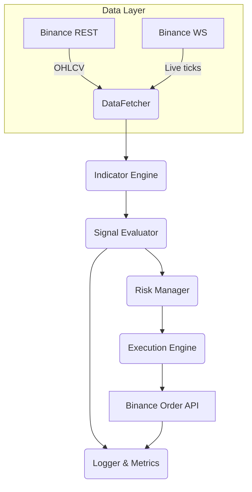

# Crypto Trading Bot – Detailed Project Description

## 1. Vision & Objectives

* **Goal:** Build a fully‑automated crypto trading agent focused on **mean‑reversion** using Bollinger Bands + RSI on Binance Spot markets.
* **Outcome Metrics:** Net profit, Sharpe > 1.5, Max Drawdown < 10 %, Hit‑rate ≥ 55 % over 12‑month live period.

## 2. Functional Requirements

### 2.1 Market Data

| Requirement      | Detail                                                         |
| ---------------- | -------------------------------------------------------------- |
| Historical OHLCV | REST `GET /api/v3/klines` – 1h, 4h, 1d intervals               |
| Live Ticks       | WebSocket `wss://stream.binance.com:9443/ws/<symbol>@kline_1m` |
| Data Retention   | Roll raw ticks →  SQL/Parquet (90 days)                        |

### 2.2 Technical Indicators

| Indicator       | Default Params                       | Library     |
| --------------- | ------------------------------------ | ----------- |
| Bollinger Bands | period = 20, std = 2                 | `pandas_ta` |
| RSI             | period = 14                          | `pandas_ta` |
| SMA             | period = 50 (trend filter, optional) | `pandas_ta` |

### 2.3 Signal Logic

```text
BUY  when  close ≤ lower_band  AND  RSI < 30
SELL when  close ≥ upper_band  AND  RSI > 70
```

* **Cool‑down:** 1 trade per symbol per 4 h.
* **Position Size:** fixed 1 % of equity (configurable).
* **Stop‑Loss / Take‑Profit:** 2 % / 4 % trailing.

### 2.4 Order Execution

| Function    | Endpoint                         | Notes                                     |
| ----------- | -------------------------------- | ----------------------------------------- |
| Place order | `POST /api/v3/order`             | MARKET (MVP), switch to LIMIT‑maker later |
| Cancel      | `DELETE /api/v3/openOrders`      | On SL/TP hit or EOD                       |
| Testnet     | `https://testnet.binance.vision` | Toggle via `--mode test`                  |

### 2.5 Risk Management

* Max concurrent positions: **3**
* Daily loss cap: **‑5 %** equity → bot pause 24 h
* API rate guard: respect 1200 req/min; global semaphore

### 2.6 Backtesting

* Framework: `backtrader` + custom analyzers
* Fee model: 0.1 % taker, adjustable
* Metrics: CAGR, Sharpe, Sortino, Max DD, Profit‑factor, W/L ratio

### 2.7 Logging & Monitoring

* Structured JSON logs via **Loguru**
* Prometheus exporter (`prometheus_client`) → Grafana dashboard
* Slack webhook alerts: trade open/close, errors, ROI daily digest

### 2.8 Deployment & Ops

| Item          | MVP                   | Production                                 |
| ------------- | --------------------- | ------------------------------------------ |
| Runtime       | `python 3.12` in venv | Docker 26 / Alpine                         |
| Host          | Local dev             | Hetzner CX22 VPS (Ubuntu 22.04)            |
| Orchestration | –                     | systemd service or K8s CronJob             |
| CI/CD         | GitHub Actions        | Build → Test → Push image → Deploy via SSH |

## 3. Non‑Functional Requirements

* **Latency:** < 1 s from signal to order
* **Uptime:** 99.5 % measured monthly
* **Security:** API keys AES‑256 encrypted at rest; `.env` for dev, Vault in prod
* **Extensibility:** Strategy router interface for additional indicators/exchanges

## 4. Tech Stack

```text
Python 3.12
ccxt==4.*          # exchange abstraction
python-binance==1.*
pandas==2.*
pandas-ta==0.*
backtrader==1.*
loguru==0.*
python-dotenv==1.*
prometheus_client==0.*
pytest, coverage
Docker, GitHub Actions, Slack SDK
```

## 5. High‑Level Architecture



## 6. Development Roadmap

| Phase              | Duration | Deliverables                                      |
| ------------------ | -------- | ------------------------------------------------- |
| P0 – Setup         | 1 week   | Repo skeleton, CI, Dockerfile, .env.sample        |
| P1 – Backtester    | 2 weeks  | Historical loader, strategy class, metrics report |
| P2 – Paper Trade   | 2 weeks  | Testnet mode, trade journal CSV, Slack alerts     |
| P3 – Live MVP      | 1 week   | Deploy to VPS, nightly PnL report                 |
| P4 – Observability | 1 week   | Prometheus, Grafana dashboards                    |
| P5 – Optimization  | ongoing  | Parameter sweep with Optuna, add SMA filter       |

## 7. Task Breakdown (Granular)

1. **Project bootstrap** – init git, `pyproject.toml`, pre‑commit hooks
2. **DataFetcher module** – wrapper around ccxt / binance‑async
3. **Indicator module** – BB, RSI, SMA via `pandas_ta`
4. **Strategy Engine** – rule‑based evaluation
5. **Execution module** – REST + WS key management
6. **Backtesting harness** – integrate backtrader analyzers
7. **Logging & Alerts** – loguru, Slack webhook util
8. **Dockerization** – multi‑stage build, non‑root user
9. **CI pipeline** – lint, unit‑tests, codecov
10. **Infrastructure** – Terraform Hetzner (optional), systemd

## 8. Configuration & Secrets

```yaml
# config.yml
symbols:
  - BTC/USDT
  - ETH/USDT
  - SUI/USDT
interval: 1h
bb:
  length: 20
  std: 2
rsi:
  length: 14
risk:
  max_open_positions: 3
  stop_loss_pct: 0.02
  take_profit_pct: 0.04
```

`.env` keys:

````
BINANCE_API_KEY=xxx
BINANCE_API_SECRET=yyy
MODE=test   # test | live
SLACK_WEBHOOK=https://hooks.slack.com/services/...```

## 9. Risks & Mitigations
| Risk | Impact | Mitigation |
|------|--------|-----------|
| API downtime | Missed trades | Exponential back‑off, fallback WS stream |
| Trend market | Strategy underperforms | SMA trend filter, dynamic params |
| Key leakage | Loss of funds | Vault, least‑privilege IP whitelisting |

## 10. Future Enhancements
- Multi‑exchange (OKX, KuCoin) via ccxt
- Web UI (FastAPI + React) for strategy toggles
- AI reinforcement learning for parameter tuning
- Portfolio rebalancing across coins

## 11. References
- Binance Spot API Docs (REST & WS, accessed 20 May 2025)
- ccxt 4.x documentation
- pandas‑ta user guide
- Backtrader reference manual

---
**Author:** Lazar Gošić / ChatGPT collaboration · v0.1 (20‑May‑2025)

````
